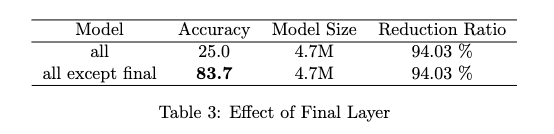
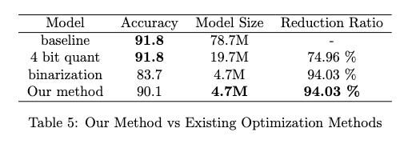

# Project Description: Transformer-Acceleration
This repository is about conducting quantization and binarization on transformer to accelerate transformer models.

**Motivation**: Transformer is a SOTA base model for many NLP&CV tasks because of its ability to accomodate large-scale data. However, the main disadvantage of transformer is its large model size and even larger runtime memory usage. Therefore, it is important to explore diverse ways to compress model to lower hardware cost. Among diverse model compression techniques, quantization and Binarization are famous because of their simplicity of implementation, preservation of original model structure and robustness to noise.

So how to explore efficient and effective quantization and binarization methods for transformer is main focus of our project, so that we can accelerate the training and it reaches a converging point faster.

**Goal**: We want to

1. Implement and modify diverse quantization and binarization methods to see how does it perform on transformer.
2. Explore the internal feature of transformer structure and design special quantization/binarization pattern to improve optimization on transformer.
3. Reach a trade-off between model size and bearable classification error as an optimal compression strategy.

**Approach**: We construct a transformer model with two encoder layers for text classification task as our baseline. We use AG_NEWS as target dataset. Basic quantization (weights only), fully quantization (weights and activation) and binarization methods are implemented and tested on transformer. We also explored sensitivity of different parts of transformer and designed a speical pattern for transformer quantization that only quantizing Query and Key without Value, based on the observation that we only cares similarity between query and key instead of absolute values. 

**Novelty**: We propose a method that is more compressed than quantization and more accurate than binarized method.

Instead of mapping weights to -1 and 1 like we do in binarized neural network, we use cluster representative to get more accurate representation of weights without losing much information.


**Experiments**: We designed three experiments to explore quantization pattern for transformer.

In our first experiment, we implement and modify diverse quantization methods and basic binarization to see how does it perform on transformer.

Our second experiment is focused on sensitivity of different parts of transformer. We leave out input embedding layer and quantize other parts of transformer respectively to see the sensitivity of each part. Then based on our observation, we designed two improvements to accommodate specialty of transformer.

In our third experiment we compared our method with baseline, 4 bit Quantized (weights only) and basic binarized model. We compare the accuracy, model size and reduction ratio and highlight the best one.

For all models on all experiments, we maintained the same training setting and trained for 10 epochs for comparability.
 

# Code Structure

**/quantization**: core codes including transformer definition, quantization, binarization. 

Inside this directory, `transformer.py` - definition of baseline transformer model; `quantize.py` - codes for basic quantization (weight only); `fully_quantize.py` - codes for fully quantization (quantize both weight and activation);  `binarize.py` - codes for basic binarization; `pytorch_api.py` - pytorch API for simple quantization, used for quickly go through essential ideas of quantization, not used in final experiment
 
**/utils**: util functions used in model training and other experiments

Inside this directory, `constants.py` - some pre-defined constants for model definition and training; `data_utils.py` - functions to construct dataset; `train_utils.py` - help functions used in training; `training.py` - core training codes; `check_runtime.py` - functions used to compute runtime memory size; `pretrained.py` - functions to load pre-trained model weights; `utils.py` - other help functions
 
**/res**: save models, training logs, test results of different experiments

**/figures**: save figures for expeirments

`train_script.py`: main function to train model w or w/o quantization

`plot.ipynb`: used to plot figures

# Example commands to run

Training codes for different baseline/quantized/binarized model are provided in this repository. To run  -

1. Clone the repository
2. Go to project directory
3. Setup a virtual environment
   
```
virtualenv -p python3 llm_env
source ./llm_env/bin/activate
```

4. Install dependencies
   
```
pip3 install -r requirements.txt
```

## Train baseline model

To train baseline transformer model on AG_NEWS dataset without any quantization/binarization, you can use command without any arugments, which is

```
python3 train_script.py
```

For any model, you can specify argument `--exp_name` to name your own experiment, like 

```
python3 train_script.py --exp_name baseline
```

The results will be saved in as `./res/baseline_best.pth` for best model, `./res/baseline_log.csv` for training log and `./res/baseline_test.npy` for test set performance. Training log and test set performance can be plotted in plot.ipynb to visualize.

## Train quantization model

To train quantization model, you should specify argument `--quant_type` to 'quantization', and you can choose quantize method from ['basic', 'fully'] by specifying argument `--quant_method`, also you must specify bit number for paramter and/or activation by setting argument `--bit_num` as one of [8,4,2].

For example, if you want to train a model using fully quantization and 8 bit, you can use command like 

```
python3 train_script.py --quant_type quantization --quant_method fully --bit_num 8
```

## Train binarization model

Training of binarization model is similar, you should specify argument `--quant_type` as 'binarization' and choose quantize method from ['basic', 'Optimized'] and set as argment `--quant_method`. However, for binarization method, `--bit_num` will not work since every parameter will be set as 1bit. Instead, you can binarize part of the model by specifying argument `--quant_pattern` as one of ['ALL', 'ALL_QK'], which means binarizing all model, all model with only query/key without value respectively.

For example, if you want to train a model using our optimized binarization method and binarize the whole model with QK, you can use command like


```
python3 train_script.py --quant_type binarization --quant_method optimized --quant_pattern ALL_QK
```

# Experiment and Results

## Experiment 1: Effectiveness of different quantization methods and basic binarization
In our first experiment, we implement and modify diverse quantization methods to see how it works for transformer. Here are the results for our first experiment. On the left is the training curve plotted every 100 iterations. On the right side is the test set performance for every epoch. On bottom is the final performance and model size table. First part is for quantization and second part is for binarization.

### Quantization part


### Binarization part


### Observation

For quantization, we can see that basic quantization, which quantizes weight only, performs very well, it reduces model size a lot with nearly no sacrifice of accuracy. To continue, we develop model based on fully quantization method, which quantizes both weight and activation. This model has large runtime size reduction, but suffers from a drop in performance, which indicates that activation is more important for transformer. We will design different methods to improve later.

For binarization, the model size is significantly reduced, but also a large drop in performance can be observed, which results from extremely limited model representation ability. 


## Experiment 2: Sensitivity of different parts of transformer
As we saw from experiment 1, Basic Binarization providing a lower accuracy. So if the whole model is binarized, it cannot learn anything. We will try solve this problem by next two improvements.

### Improvement1 - Final linear layer is crucial

After some analysis, we found that the final linear layer in classifier is crucial. We trained two models, one with all layers binarized and one with all but final layer binarized. Results are shown below:




We can see that if the final layer remains full precision, the whole model performance will increase to normal. We guess that it is because final layer controls the output scores for each class.

### Improvement2- Treat Q,K,V in attention layer differently

Then, as we discussed before, we think query and key should be more robust to binarization based on the intuition that similar items should still be similar even if binarized. We compare model with QKV all binarized and that with only QK binarized. To ensure that the improvement does not come from increment of full precision parameters. We also trained model with only QV and KV binarized. The results show that QK model only has significant better performance over others, which proves our assumption. Results are shown below:


## Experiment 3: Our Method against Baseline, Quantization and Binarization

In our third experiment, we compared our method with baseline, 4 bit Quantized (weights only) and basic binarized model. We compare the accuracy, model size and reduction ratio and highlight the best one. Results are shown below:




We can see that our method not only accelerate convergence, but also having a model size as basic binarized model size. So we have better accuracy and reduction ratio from modified Binarized method. Note that an important advantage of our method is that we do not need pretrained weights anymore, which may accelerate whole training process.
